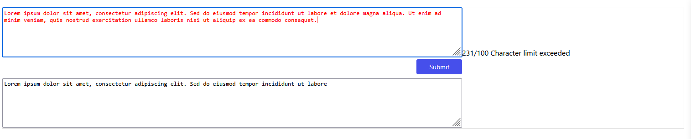

A PCF componenet to use in Power Apps.

Count the characters as the user types. If the characters are more than 100, then the text turns red with a text label that 'Character limit exceeded'.
If the user presses the submit button, only the first 100 characters are transferred to the textarea.

